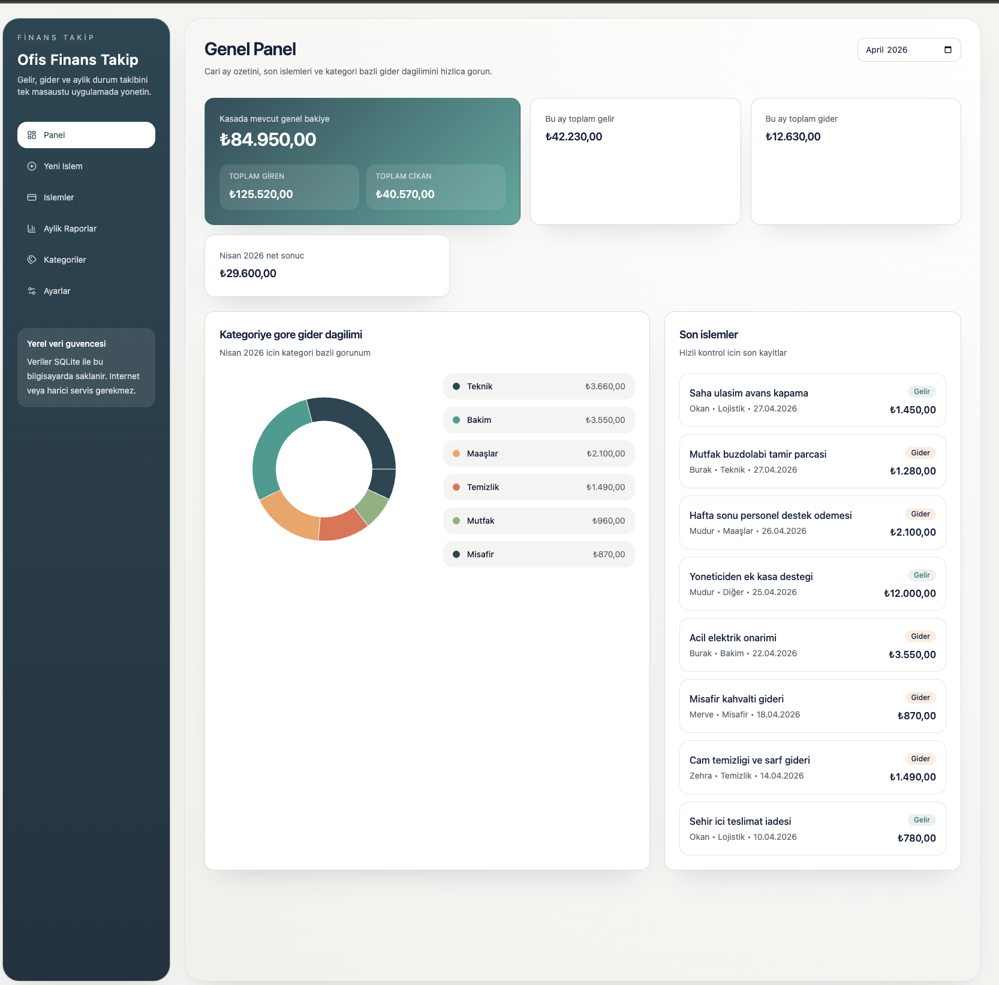
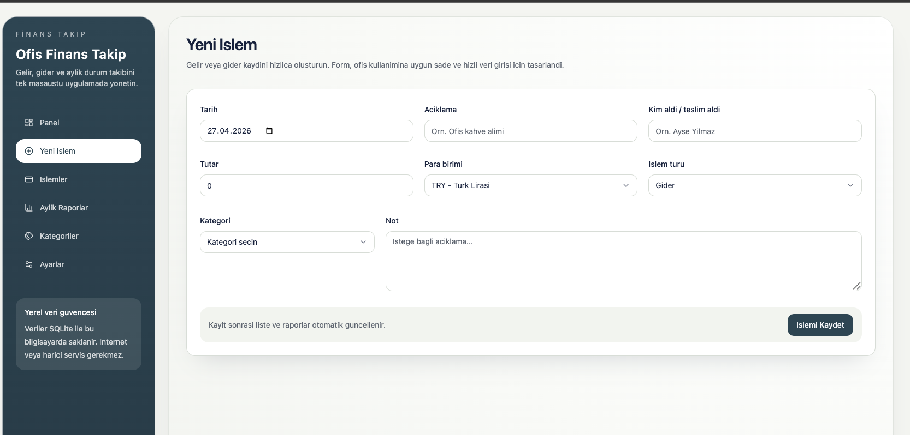
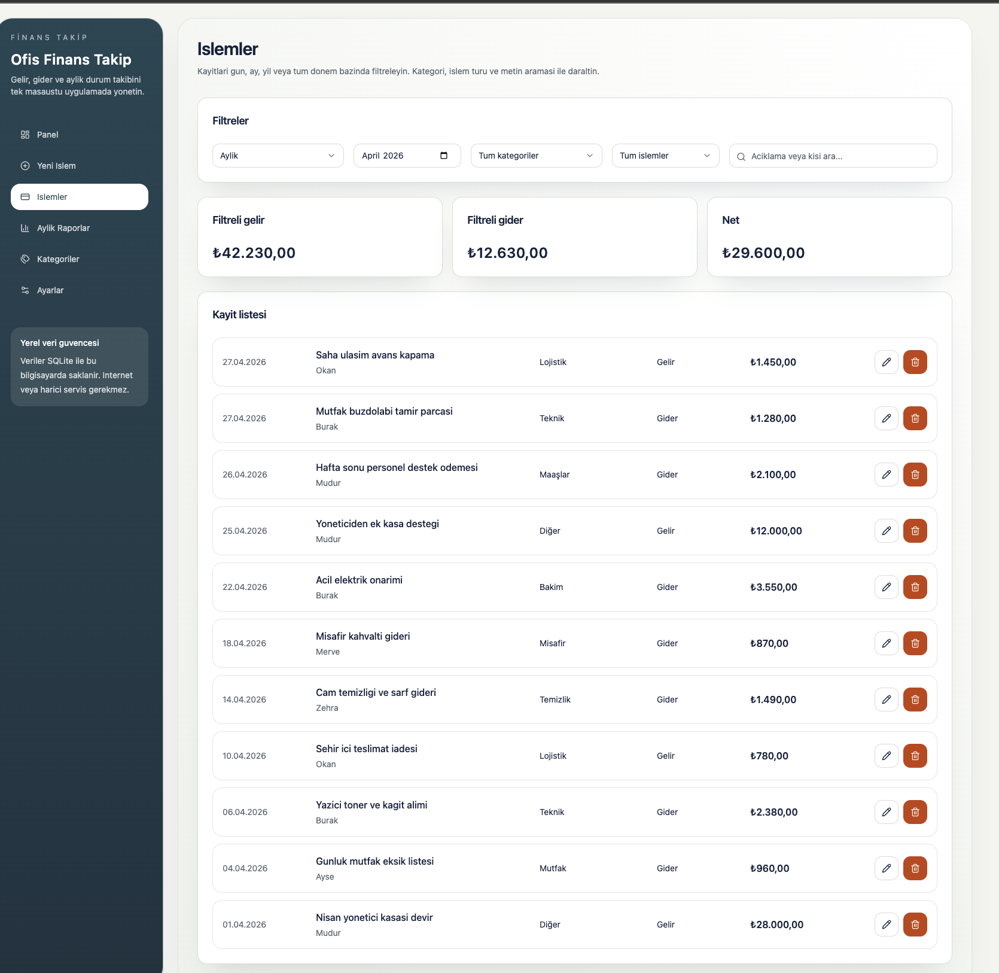
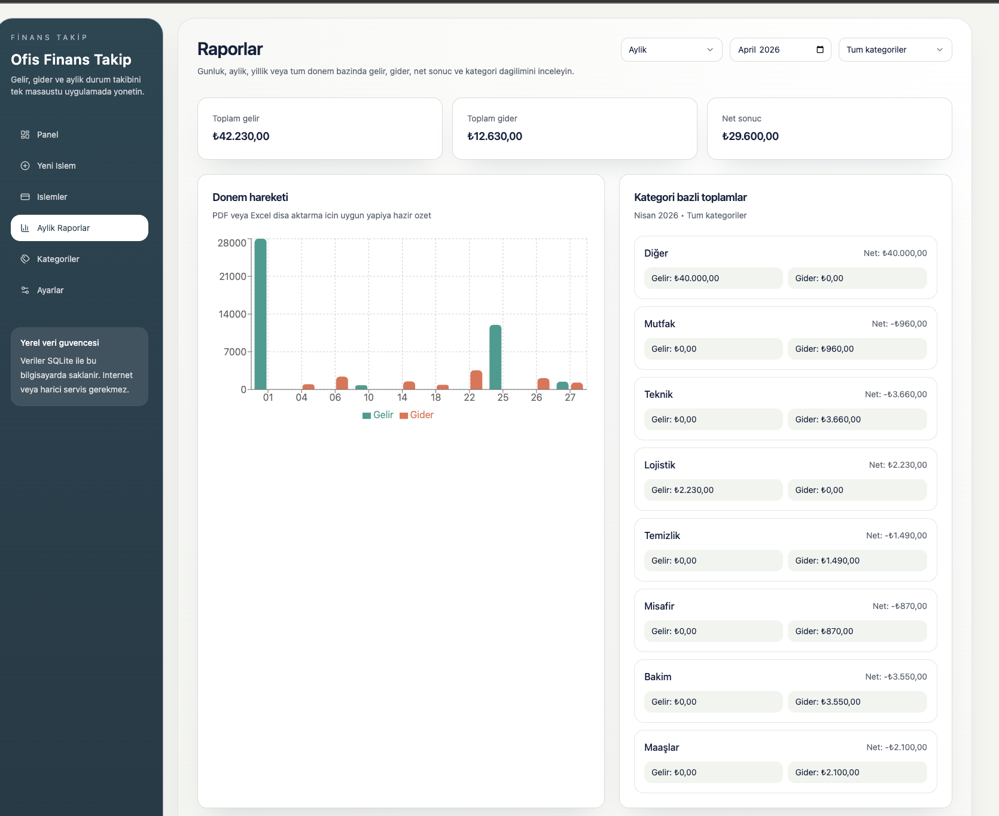
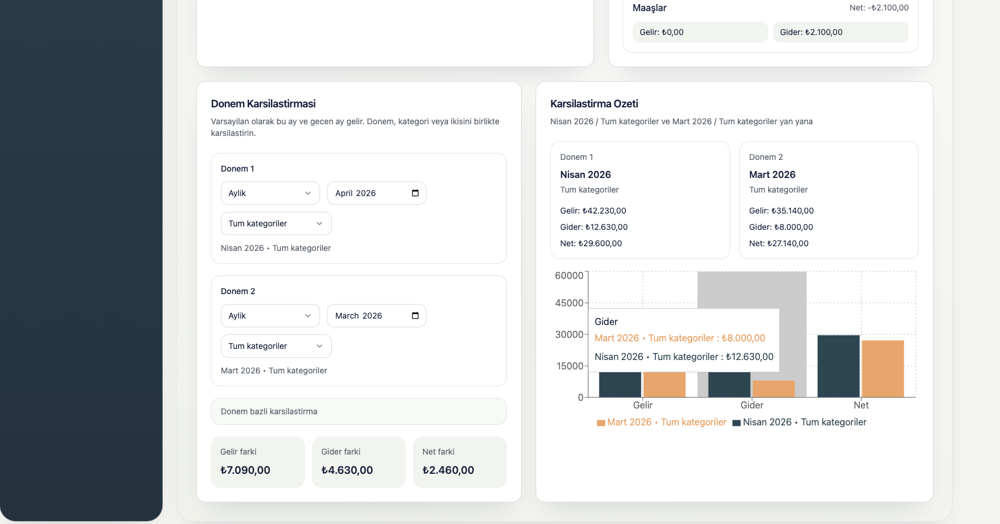
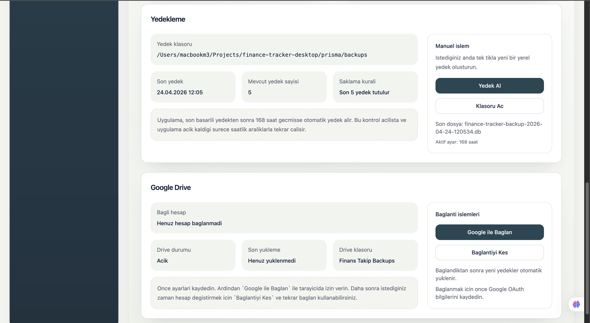

# Finance Tracker Desktop

A desktop-first internal finance tracking app built to replace spreadsheet-based income and expense workflows with a simpler, more reliable local application.

The UI is in Turkish, while the codebase and documentation are kept maintainable for broader reuse. The current MVP is suitable for office use and can also be adapted for other organizations.

## Overview

This project combines:

- Next.js + React + TypeScript for the frontend
- Tailwind CSS for styling
- shadcn/ui-style reusable components
- Recharts for reporting visuals
- Express for the local API layer
- SQLite + Prisma for local data storage
- Electron for desktop packaging

The app is designed to run fully on a local work computer, with optional Google Drive backup support.

## Core Features

- Turkish interface for non-technical office users
- Transaction entry form with validation
- Income and expense tracking
- Category management
- Transaction filtering, search, editing, and deletion
- Dashboard with current-period and all-time summaries
- Daily, monthly, yearly, and full-period reports
- Period-to-period comparisons
- Local SQLite storage
- Manual and scheduled backups
- Optional Google Drive backup upload
- Electron packaging for desktop distribution

## Screenshots

### Dashboard



### New Transaction



### Transactions



### Reports



### Comparison View



### Settings



## Main Pages

- `Dashboard`
- `Yeni Islem`
- `Islemler`
- `Aylik / Gunluk / Yillik Raporlar`
- `Kategoriler`
- `Ayarlar`

## Development

Install dependencies:

```bash
npm install
```

Prepare Prisma and seed the local database:

```bash
npm run prisma:generate
npm run prisma:seed
```

Start web + local API in development:

```bash
npm run dev
```

This starts:

- Next.js on `http://localhost:3000`
- Express API on `http://localhost:3001`

To run the Electron shell during development as well:

```bash
npm run dev:desktop
```

## Production Build

Build the application:

```bash
npm run build
```

Create a packaged desktop installer:

```bash
npm run dist
```

Build artifacts are generated in `release/`.

## GitHub Actions Windows Build

The repository includes a ready-to-run workflow:

- `.github/workflows/build-desktop.yml`

To build a Windows installer from GitHub:

1. Push the repository to GitHub.
2. Open the `Actions` tab.
3. Select `Build Desktop App`.
4. Run the workflow.
5. Download the `finance-tracker-windows` artifact after the job finishes.

The artifact typically contains:

- a Windows installer `.exe`
- update metadata files such as `latest*.yml`
- optional `.blockmap` files

## Database and Local Storage

- Prisma schema: `prisma/schema.prisma`
- Development database: `prisma/finance-tracker.db`
- Packaged desktop database: stored under the Electron app data directory
- Local backups: stored in the configured backup folder
- Local credentials and backup secrets: stored outside the tracked repository and ignored by Git

## Backups

The application supports:

- manual local backups
- automatic scheduled local backups
- configurable backup directory
- configurable auto-backup interval
- retention of the latest 5 backups
- optional upload of backup files to Google Drive

## Security Notes

Recent hardening included:

- restricted localhost API CORS behavior
- local API session protection for browser access
- removal of Google client secret exposure from frontend responses
- local secret storage moved out of SQLite into ignored credential files
- Electron renderer sandbox enabled

## Known Limitations

- PDF/Excel export is not fully implemented yet
- The Google Drive backup flow is intended for trusted internal usage, not multi-tenant cloud deployment
- `npm audit` may still report dependency advisories that require a separate upgrade pass for libraries such as `next`, `prisma`, or `xlsx`

## Seeded Default Categories

The seed process creates these initial categories:

- `Mutfak`
- `Teknik`
- `Maaslar`
- `Diger`

## Packaging Notes

- The packaged desktop app does not require Node.js or development tools on the target machine
- Unsigned Windows builds may trigger SmartScreen warnings on first launch
- Installer branding and icons are generated from assets in the `build/` directory

## License

MIT
